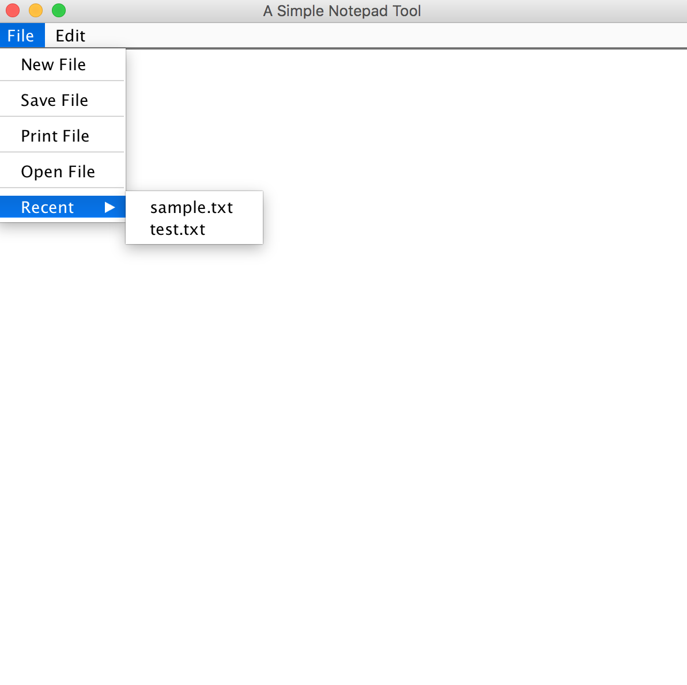

# Simple Notepad
This is a Java GUI application that allows all basic file editing functionality:
1. Create a new file
2. Save a file
3. Print a file
4. Open a file
5. Open recent files
6. Copy, paste, replace text

## Application Snapshot

